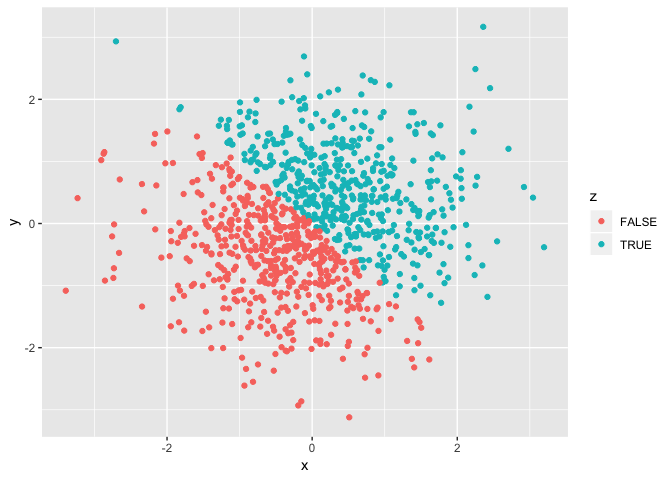
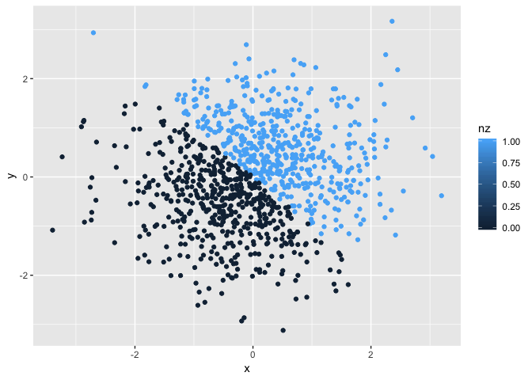

Homework 1
================
Aakriti Gupta
2018-09-21

**Problem 1**
-------------

We will first create a dataframe containing variables of four different types: (1) random sample of 10 numbers from a uniform distribution between 0 to 5 (2) logical vector indicating whether the numbers from the sample are greater than 2 (3) character variable of length 10, (4) factor variable of length 10

``` r
hw1_df = tibble(
vec_rsamp = runif(n = 10, min = 0, max = 5),
vec_logical = vec_rsamp >= 2,
vec_char = letters[1:10],
vec_factor = rep(c("Male", "Female"), length = 10)
)
hw1_df
```

    ## # A tibble: 10 x 4
    ##    vec_rsamp vec_logical vec_char vec_factor
    ##        <dbl> <lgl>       <chr>    <chr>     
    ##  1     2.44  TRUE        a        Male      
    ##  2     4.85  TRUE        b        Female    
    ##  3     1.30  FALSE       c        Male      
    ##  4     3.35  TRUE        d        Female    
    ##  5     0.595 FALSE       e        Male      
    ##  6     3.97  TRUE        f        Female    
    ##  7     1.61  FALSE       g        Male      
    ##  8     4.31  TRUE        h        Female    
    ##  9     3.95  TRUE        i        Male      
    ## 10     3.51  TRUE        j        Female

### *Calculation of means*

Now we will try to take the mean for all these variables.

``` r
mean(hw1_df[["vec_rsamp"]])
```

    ## [1] 2.987698

``` r
mean(hw1_df[["vec_logical"]])
```

    ## [1] 0.7

``` r
mean(hw1_df[["vec_char"]])
```

    ## Warning in mean.default(hw1_df[["vec_char"]]): argument is not numeric or
    ## logical: returning NA

    ## [1] NA

``` r
mean(hw1_df[["vec_factor"]])
```

    ## Warning in mean.default(hw1_df[["vec_factor"]]): argument is not numeric or
    ## logical: returning NA

    ## [1] NA

We are only able to get the mean for vec\_rsamp becaue it is a numeric variable and vec\_logical because it is a logical varoable with value of 0 or 1. All the others are not numeric variables and so it is not possible to calculate a mean.

### *Conversion of variables*

We will now try to convert the on-numeric variables into numeric variables.

1.  Converting the character variable into numeric variable

``` r
nvec_char = as.numeric(hw1_df[["vec_char"]])
```

    ## Warning: NAs introduced by coercion

``` r
nvec_char
```

    ##  [1] NA NA NA NA NA NA NA NA NA NA

It introduces NAs in place of characters

1.  Converting the logical variable into numeric variable

``` r
nvec_logical = as.numeric(hw1_df[["vec_logical"]])
nvec_logical
```

    ##  [1] 1 1 0 1 0 1 0 1 1 1

It introduces 0 or 1 values based on whether the values were true or false

1.  Converting the factor variable into numeric variable

``` r
nvec_factor = as.numeric(hw1_df[["vec_factor"]])
```

    ## Warning: NAs introduced by coercion

``` r
nvec_factor
```

    ##  [1] NA NA NA NA NA NA NA NA NA NA

It introduces NAs in place of the factorial values

### *Second part of variable conversion:*

1.  Converting character variable from character to factor to numeric

``` r
fvec_char = as.factor(hw1_df[["vec_char"]])
fvec_char
```

    ##  [1] a b c d e f g h i j
    ## Levels: a b c d e f g h i j

``` r
nfvec_char = as.numeric(fvec_char)
nfvec_char
```

    ##  [1]  1  2  3  4  5  6  7  8  9 10

This code first converts the charactors into factor variables of 10 levels and then finally converts them into numeric values.

1.  Converting factor variable from factor to character to numeric

``` r
cvec_char = as.character(hw1_df[["vec_factor"]])
cvec_char
```

    ##  [1] "Male"   "Female" "Male"   "Female" "Male"   "Female" "Male"  
    ##  [8] "Female" "Male"   "Female"

``` r
ncvec_char = as.numeric(cvec_char)
```

    ## Warning: NAs introduced by coercion

``` r
ncvec_char
```

    ##  [1] NA NA NA NA NA NA NA NA NA NA

This code converts the factor variable into character variable which no longer has 0 or 1 values and so it not able to be converted into numeric values.

**Problem 2**
-------------

We will first create a data frame comprised of: x: a random sample of size 1000 from a standard Normal distribution y: a random sample of size 1000 from a standard Normal distribution A logical vector indicating whether the x + y &gt; 0 A numeric vector created by coercing the above logical vector A factor vector created by coercing the above logical vector

``` r
set.seed(1234)
hw1_df2 = tibble(
x = rnorm(1000),
y = rnorm(1000),
z = (x + y) > 0,
nz = as.numeric(z),
fz = as.factor(z)
)
hw1_df2
```

    ## # A tibble: 1,000 x 5
    ##         x      y z        nz fz   
    ##     <dbl>  <dbl> <lgl> <dbl> <fct>
    ##  1 -1.21  -1.21  FALSE     0 FALSE
    ##  2  0.277  0.301 TRUE      1 TRUE 
    ##  3  1.08  -1.54  FALSE     0 FALSE
    ##  4 -2.35   0.635 FALSE     0 FALSE
    ##  5  0.429  0.703 TRUE      1 TRUE 
    ##  6  0.506 -1.91  FALSE     0 FALSE
    ##  7 -0.575  0.939 TRUE      1 TRUE 
    ##  8 -0.547 -0.224 FALSE     0 FALSE
    ##  9 -0.564 -0.674 FALSE     0 FALSE
    ## 10 -0.890  0.446 FALSE     0 FALSE
    ## # ... with 990 more rows

### *In-line coding*

This dataframe contains a vector with 1000 observations. The mean of the variable x is -0.0265972 and the median is -0.0397942. The proportion of cases for which the logical vector is true is 0.498.

### *Making the scatterplot*

1.  Color points using logical variable

``` r
ggplot(hw1_df2, aes(x=x, y=y, color=z)) + geom_point()
```



``` r
ggsave("scatter_plot_hw1.pdf", height = 4, width = 6)
```

1.  Color points using numeric variable

``` r
ggplot(hw1_df2, aes(x=x, y=y, color=nz)) + geom_point()
```



1.  Color points using factor variable

``` r
ggplot(hw1_df2, aes(x=x, y=y, color=fz)) + geom_point()
```


All the scatter plots essentially look similar because the points colored based only on 2 values - in the case of logical - true vs. false, in the case of numeric - 1 vs. 0 and in the case of factor - "true" vs. "false"
